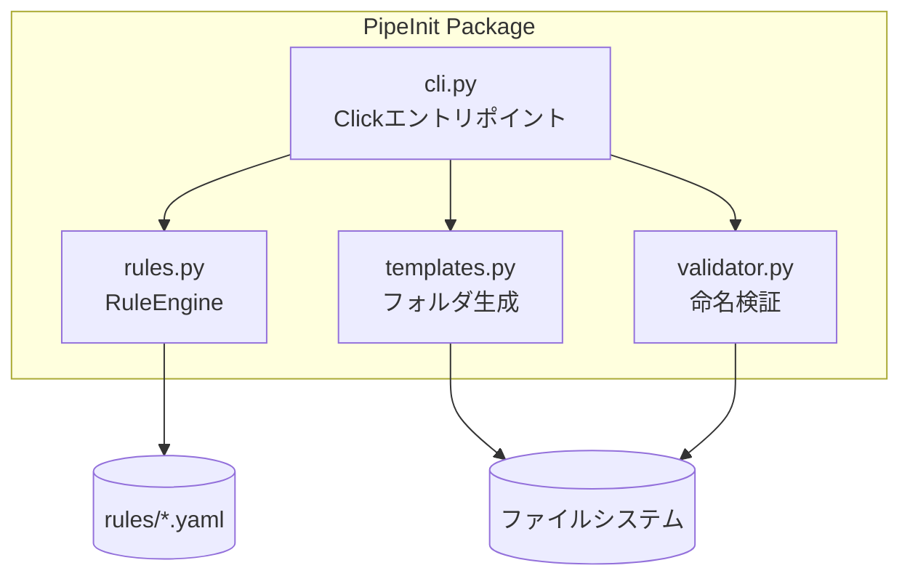

# 仕様書: PipeInit

| 項目 | 値 |
|------|---|
| 版 | 0.1 |
| 作成日 | 2026-09-07 |
| 最終更新 | 2026-09-07 |
| ステータス | ドラフト |
| 著者 | 金子直樹 |
| 関連 | [要件定義書](./要件定義書.md) |

> 本書は要件定義書の決定を実装パラメータレベルに落とし込む。CLIツールという性質上、`api-spec` → CLIインターフェース仕様、`screen-spec` → 該当なし、`infra-and-runbook` → ローカル配布+CI相当、のように読み替えて適用する（元の16セクション構成・番号は維持）。

---

## 1. quick-reference

| 項目 | 値 |
|------|---|
| リポジトリ | `~/dev/pipeinit`（GitHub公開後は `github.com/<user>/pipeinit`） |
| インストール | `pipx install .`（開発時は `pip install -e ".[dev]"`） |
| 実行確認 | `pipeinit --help` |
| テスト実行 | `pytest --cov=pipeinit` |
| CI | `.github/workflows/ci.yml`（push/PR時に自動実行） |
| リリース | `git tag vX.Y.Z && git push --tags` → GitHub Releases手動作成 |
| ロールバック | `git checkout <前のtag>` |
| 障害時の一次対応先 | 該当なし（常時稼働サービスではないため運用オンコール不要） |

---

## 2. overview-and-architecture

### 2.1 C4 Context


### 2.2 C4 Container



### 2.3 同期/非同期の境界

全処理が同期実行（CLIコマンド1回の呼び出し内で完結）。非同期処理は存在しない。

### 2.4 データフロー

書き込み経路：`init`/`bump --apply` のみがファイルシステムに書き込む。`validate` は読み取り専用。

### 2.5 外部システム

なし（v1はネットワーク通信を一切行わない）。

### 2.6 ADR索引

| ADR | タイトル | ステータス |
|---|---|---|
| ADR-0001 | 正規表現+YAML方式の採用（パーサー自作を却下） | Accepted |
| ADR-0002 | DBを使わずYAMLを正本とする | Accepted |

### 2.7 障害時の縮退

該当なし（常時稼働サービスではないため縮退モードの概念がない）。ルールYAMLの構文エラー時は該当ルールのみ無効化せず、コマンド全体をエラー終了させる（設定不備を隠さない設計判断）。

### 2.8 将来の拡張余地

ShotGrid/Perforce連携（外部API呼び出し）を追加する場合、`rules.py` と同階層に `integrations/` パッケージを新設し、CLIコマンド層には影響を与えない設計とする。

---

## 3. tech-stack-and-repo

### 3.1 技術スタック確定表

| カテゴリ | 採用 | 正確なバージョン |
|---|---|---|
| 言語 | Python | 3.11.x |
| CLI | Click | 8.1.7 |
| YAML | PyYAML | 6.0.2 |
| テスト | pytest | 8.3.x |
| カバレッジ | pytest-cov | 5.0.x |
| Lint | flake8 | 7.1.x |
| Format | black | 24.x |
| import整列 | isort | 5.13.x |
| 型チェック | mypy | 1.11.x（`coding-style.md` 型ヒント方針に対応） |
| 脆弱性チェック | pip-audit | 2.7.x |

> 実装開始時に `pip install` で解決される最新の安定版に合わせて `pyproject.toml` を確定し、本表を実測値で更新する（<!-- 要レビュー -->）。

### 3.2 リポジトリ構成

モノレポではなく単一パッケージリポジトリ。

### 3.3 ディレクトリ構成

```
pipeinit/
├── pipeinit/
│   ├── __init__.py
│   ├── cli.py          # Clickエントリポイント（init/validate/bump）
│   ├── rules.py        # YAMLルール読込・スキーマ検証
│   ├── templates.py    # フォルダツリー生成
│   └── validator.py    # 命名規則・バージョン検証
├── rules/
│   ├── game.yaml
│   ├── film.yaml
│   └── generic.yaml
├── tests/
│   ├── test_validator.py
│   ├── test_templates.py
│   └── test_cli.py
├── docs/
│   ├── 要件定義書.md
│   ├── 仕様書.md
│   └── adr/
├── .github/workflows/ci.yml
├── pyproject.toml
├── LICENSE
└── README.md
```

### 3.4 環境数

`local`（開発）のみ。`staging`/`production`という概念は存在しない（配布物はPyPIパッケージ/GitHub Release）。

### 3.5 環境差分管理

該当なし（環境変数を必要としないツール。§11.5で補足）。

### 3.6 パッケージマネージャ

pip（`pyproject.toml` + `pip install -e ".[dev]"`）。個人開発の小規模パッケージのためPoetry/uv等は導入せず標準ツールで完結させる。

### 3.7 ランタイムバージョン固定

`pyproject.toml` に `requires-python = ">=3.11"` を明記。

### 3.8 主要コマンド一覧

| コマンド | 用途 |
|---|---|
| `pip install -e ".[dev]"` | 開発環境セットアップ |
| `pytest --cov=pipeinit` | テスト実行 |
| `black . && isort . && flake8` | フォーマット・Lint |
| `pipeinit init --type game` | フォルダ生成 |
| `pipeinit validate ./project` | 命名検証 |
| `pipeinit bump <file>` | バージョン採番 |

---

## 4. data-design

DBを持たないため「データ」はYAMLルールファイルとファイルシステム上のパス構造を指す。

### 4.1 概要

正本は `rules/*.yaml`。実行時にメモリ上へロードし、コマンド終了とともに破棄する（永続化なし）。

### 4.2 ルールファイル スキーマ定義

```yaml
# rules/game.yaml
project_type: game
version_format: "v{n:03d}"          # v001, v002 ... v1000で桁拡張
folder_template:
  - path: "assets/characters"
    required: true
  - path: "assets/environments"
    required: true
  - path: "shots"
    required: true
naming_patterns:
  - pattern: '^SHOT\d{3}_[a-z]+_v\d{3}\.\w+$'
    description: "ショットファイル命名規則（例: SHOT010_lighting_v003.hip）"
  - pattern: '^[A-Z][A-Za-z0-9_]*\.(fbx|abc|usd)$'
    description: "アセットファイル命名規則"
```

### 4.3 データ辞書

| キー | 型 | 必須 | 既定値 | 説明 |
|---|---|---|---|---|
| `project_type` | string | ◯ | - | ルールファイルの識別子、`--type` と一致させる |
| `version_format` | string | ◯ | `v{n:03d}` | バージョン番号のフォーマット文字列 |
| `folder_template[].path` | string | ◯ | - | 生成する相対パス |
| `folder_template[].required` | bool | - | true | falseの場合、存在しなくても警告に留める |
| `naming_patterns[].pattern` | string(regex) | ◯ | - | Pythonの`re`モジュール互換の正規表現 |
| `naming_patterns[].description` | string | ◯ | - | 違反時にユーザーへ表示する説明文 |

### 4.4 PII分類

該当なし。ルールファイル・生成対象パスに個人情報は含まれない（プロジェクト名等が偶然個人名を含む可能性はあるが、ツール自体が収集・送信する情報ではないため対象外）。

### 4.5 保持期間・削除戦略

該当なし（永続ストレージを持たない）。

### 4.6 監査カラム

該当なし。

### 4.7 ID戦略

該当なし（エンティティのID発行を行わない。ファイルパス自体が識別子）。

### 4.8 インデックス戦略

該当なし。

### 4.9 マイグレーション戦略

ルールYAMLのスキーマを変更する場合、後方互換のため新フィールドは「省略可能・既定値あり」で追加し、既存YAMLファイルの書き換えを強制しない方針とする（Expand的な考え方の簡易適用）。

### 4.10 バックアップ

該当なし（ユーザー自身のファイルシステムはユーザーの責任範囲。ツールはバックアップ機能を持たない。SEC-003によりドライラン既定で誤破壊を防止）。

---

## 5. cli-interface-spec（api-specの読み替え）

REST APIを持たないため、本セクションはCLIのインターフェース仕様として定義する。

### 5.1 設計原則

Clickのサブコマンド方式。1動詞1コマンド（`init` / `validate` / `bump`）。

### 5.2 コマンド一覧

| コマンド | 引数/オプション | 認証 | 備考 |
|---|---|---|---|
| `pipeinit init` | `--type {game,film,generic}`（必須）、`--path`（既定=カレントディレクトリ） | 不要 | FR-001 |
| `pipeinit validate` | `<path>`（必須）、`--rules`（任意、既定は`--type`自動判定）、`--format {text,json}` | 不要 | FR-002 |
| `pipeinit bump` | `<filename>`（必須）、`--apply`（既定false=ドライラン） | 不要 | FR-003 |

### 5.3 出力フォーマット

- `text`（既定）：人間可読、色付き（`NO_COLOR`尊重）
- `json`：`{"violations": [{"file": "...", "rule": "...", "message": "..."}], "count": N}` 形式。CI連携用。

### 5.4 exit code 規約

| code | 意味 |
|---|---|
| 0 | 成功・違反なし |
| 1 | 命名規則違反あり（`validate`） |
| 2 | ルールYAMLの構文エラー（E001） |
| 3 | 不正な引数・未知のプロジェクト種別（E002） |
| 4 | 検証対象パス不在（E003） |

### 5.5 エラーカタログ（RFC 9457の思想をCLIメッセージに適用）

| code | メッセージ例 | 発生条件 |
|---|---|---|
| E001 | `Error: rules/game.yaml contains invalid YAML at line 12` | YAML構文エラー |
| E002 | `Error: unknown project type 'gaem'. Available: game, film, generic` | 未知の`--type` |
| E003 | `Error: path './project' does not exist` | 検証対象パス不在 |
| E004 | `Error: 'foo.txt' does not match any known version pattern` | bump対象がパターン不一致 |

### 5.6 冪等性

`init` は既存パスがある場合スキップしログに残す（上書きしない）。`bump --apply` は同一ファイルに対する2回目の実行は新たな次バージョンを算出するため冪等ではなく「安全な逐次操作」として明記する（要件定義書 FR-005の冪等性は主に`init`が対象）。

### 5.7 バージョニング

CLI自体のバージョニングはSemVer（`pipeinit --version`で表示）。ルールファイルのスキーマバージョンは v1では単一版のみ運用し、破壊的変更時に `schema_version` フィールドを追加する（§4.9参照）。

---

## 6. screen-spec

該当なし。本ツールはGUIを持たないCLIであり、画面（SCR-XXX）は存在しない。ユーザー体験の設計は §5（CLIインターフェース仕様）と §7（デザイン・UI/UX要件、要件定義書側）に集約している。

---

## 7. feature-spec

要件定義書 §5 の FR-001〜007 を実装レベルに対応付ける。

```markdown
### FR-001 プロジェクト種別選択によるフォルダツリー自動生成

- **対応コマンド**: `pipeinit init`
- **対応モジュール**: cli.py（引数解析）→ rules.py（YAML読込）→ templates.py（生成）
- **対応テスト**: tests/test_templates.py
- **シナリオ（Happy）**: `pipeinit init --type game` → rules/game.yamlのfolder_templateを解決 → フォルダ生成 → 生成一覧を標準出力
- **シナリオ（Alt）**: 既存フォルダがある場合はスキップしてレポートに含める
- **シナリオ（Error）**: 未知の`--type` → E002で終了
- **副作用**: なし（ログ出力のみ、外部通知なし）
- **冪等性**: 二重実行しても既存フォルダは変更しない
- **DoD**: `tests/test_templates.py` で衝突ケース・正常ケース双方をカバー

### FR-002 命名規則の正規表現バリデーション

- **対応コマンド**: `pipeinit validate`
- **対応モジュール**: validator.py
- **対応テスト**: tests/test_validator.py
- **シナリオ（Happy）**: 全ファイルが規則に合致 → exit code 0
- **シナリオ（Alt）**: `--format json` で機械可読出力
- **シナリオ（Error）**: パス不在 → E003
- **冪等性**: 読み取り専用のため常に冪等
- **DoD**: 違反あり/なし双方のケースがテストされ、CI上で`validate`をサンプルシーンに対して実行するジョブがある

### FR-003 バージョン番号自動インクリメント

- **対応コマンド**: `pipeinit bump`
- **対応モジュール**: validator.py内のバージョン計算ロジック（§8参照）
- **対応テスト**: tests/test_validator.py（境界値: v999→v1000等）
- **シナリオ（Error）**: パターン不一致 → E004
- **DoD**: 桁上げケースを含むパラメータ化テストが存在する
```

### 7.1 権限チェック

該当なし（認証・権限概念がないローカルCLIのため）。

---

## 8. business-logic

### 8.1 バージョン番号インクリメント計算式

```
入力: "SHOT010_lighting_v003.hip"
1. 正規表現でバージョン部を抽出: v(\d+) → "003"
2. 整数化: 3
3. インクリメント: 4
4. 元の桁数でゼロ埋め、桁あふれ時は拡張:
   - 3 → "004"（3桁のまま）
   - 999 → 1000 → "1000"（4桁に拡張、ゼロ埋めしない）
5. ファイル名を再構成: "SHOT010_lighting_v004.hip"
```

### 8.2 端数処理・特殊ケース

| ケース | 挙動 |
|---|---|
| バージョン部が存在しない | E004エラーで終了 |
| バージョン部が複数マッチ | 最後にマッチした箇所のみを対象とする（末尾優先） |
| 既に採用済みの次バージョンファイルが存在 | 警告を出すが処理は継続（上書きは`--apply`時も行わず新規ファイル名として提示のみ） |

### 8.3 計算順序

該当なし（単一の計算のみで、割引・税等の複合計算は存在しない）。

---

## 9. security-implementation

要件定義書 §12 の方針を実装パラメータに落とし込む。決済・認証・個人情報を扱わないため、該当サブセクションは簡潔に「該当なし」とする。

### 9.1 auth

該当なし（認証機能を持たない）。

### 9.2 crypto-and-keys

該当なし（暗号化・鍵管理の対象データを保持しない）。

### 9.3 headers-and-csp

該当なし（HTTPサーバーではないためヘッダ・CSPの概念が存在しない）。

### 9.4 logging-and-pii

- **ログレベル運用**: `--verbose` フラグでDEBUGレベル（スタックトレース含む）、既定はINFOレベル（ユーザー向けメッセージのみ）
- **PII**: ログに個人情報は出力しない設計（ファイルパス・ルール名のみ）

### 9.5 payment-pci

該当なし。

### 9.6 privacy-gdpr-appi

該当なし（個人情報を収集・送信しないローカルツール）。

### 9.7 実装対応（SEC-001〜004の具体化）

| SEC-ID | 実装 |
|---|---|
| SEC-001 | `rules.py` 内のYAML読込は必ず `yaml.safe_load()` を使用し、`yaml.load()` は禁止する（コードレビューチェック項目化） |
| SEC-002 | `templates.py` で生成先パスを `os.path.abspath` で正規化し、指定ベースディレクトリ配下から逸脱する場合（`..`によるパストラバーサル）はE003相当のエラーで拒否する |
| SEC-003 | `bump` はデフォルトで `--apply` なしのドライランとし、実ファイル変更には明示フラグを要求する |
| SEC-004 | `pip-audit` をCIジョブに追加し、既知の脆弱性がある依存関係の混入をブロックする |

---

## 10. async-and-batch

該当なし（同期的なCLI実行のみで、ジョブキュー・cron・イベント駆動処理を持たない）。

---

## 11. infra-and-runbook

### 11.1 環境構成・IaC

該当なし（ローカル実行かつインストール先はユーザーのPython環境。クラウドインフラを持たない）。

### 11.2 CI/CD

```yaml
# .github/workflows/ci.yml の方針
on: [push, pull_request]
jobs:
  test:
    steps:
      - checkout
      - setup-python (3.11)
      - pip install -e ".[dev]"
      - black --check .
      - isort --check .
      - flake8 .
      - mypy pipeinit/
      - pytest --cov=pipeinit --cov-report=term-missing
      - pip-audit
```

品質ゲート：上記いずれか失敗でPRマージ不可（GitHub branch protection設定）。

### 11.3 Runbook

「障害」の概念が薄いツールのため、想定トラブルシューティングとして代替する。

```markdown
## RB-001 CIが red になった場合

### 症状
GitHub Actions の pytest ジョブが失敗

### 一次対応
1. Actionsログで失敗テストを特定
2. ローカルで `pytest -k <失敗テスト名> -v` を再現
3. 直近のコミット差分を確認し原因箇所を特定

### 二次対応
- 修正後、同一PRに追加コミットしてCI再実行
- 頻発する場合はテストの安定性（flaky test）を疑いissue化
```

### 11.4 SLO

該当なし（常時稼働サービスではないため）。

### 11.5 env-vars

| 変数名 | 必須 | 既定値 | 説明 |
|---|---|---|---|
| `NO_COLOR` | - | 未設定 | 設定時はCLI出力の色付けを無効化（業界標準の慣習に準拠） |
| `PIPEINIT_RULES_DIR` | - | パッケージ同梱の`rules/` | カスタムルールディレクトリを指定する場合のみ使用 |

秘密情報を要する環境変数は存在しない。

---

## 12. testing

### 12.1 テストピラミッド配分

```
Unit: 70%（rules.py / validator.pyのロジック）
CLI統合（CliRunner）: 25%
手動E2E（実ターミナル確認）: 5%
```

### 12.2 テストツール

pytest, pytest-cov, click.testing.CliRunner

### 12.3 カバレッジ目標

| メトリクス | 目標 |
|---|---|
| Line | 80% |
| Branch | 70% |

### 12.4 CIジョブ構成

§11.2参照。全ジョブ直列（規模が小さいため並列化のメリットが薄い）。

### 12.5 テストデータ

`tests/fixtures/` 配下にサンプルのルールYAML・ダミーファイル名一覧を用意し、本物のプロジェクトデータは使用しない。

### 12.6 a11y・負荷テスト

該当なし（GUIなし、想定負荷が小規模なCLIのため）。

---

## 13. conventions

### 13.1 命名規則

`coding-style.md` 準拠：関数・変数はスネークケース、boolean変数は `is_`/`has_` プレフィックス、定数はUPPER_SNAKE_CASE。

### 13.2 型ヒント運用

全公開関数に `typing` モジュールの型ヒントを付与し、mypy strictモードでCIチェックする。

```toml
# pyproject.toml [tool.mypy] 抜粋方針
strict = true
disallow_untyped_defs = true
```

### 13.3 コメント方針

Google style docstring。WHYが非自明な箇所のみコメントを残す（`coding-style.md`・グローバル指示に準拠）。

### 13.4 インポート順序

標準ライブラリ → サードパーティ → 自パッケージ内モジュールの順（isortで強制）。

### 13.5 エラー処理

例外ベース（Result型は導入しない、Pythonの慣習に合わせる）。CLI境界（`cli.py`）で全例外を捕捉し、ユーザー向けメッセージに変換してから終了コードを返す。

---

## 14. adr

### 14.1 運用方針

形式：Michael Nygard。保存場所：`docs/adr/NNNN-decision-title.md`。個人開発のためレビューはセルフレビューとし、ADR本文にその旨を明記する。

### 14.2 ADR-0001（本文）

```markdown
# ADR-0001: 正規表現+YAML方式の採用

## Status
Accepted (2026-09-07)

## Context
命名規則はスタジオごとに異なる文字列パターンの集合であり、構文木を持つ複雑な言語ではない。
専用パーサーやDSLを自作するのはこの問題の複雑さに対して過剰である。

## Decision
命名規則は正規表現、フォルダ構成・切り替え設定はYAMLで表現し、
RuleEngineがYAMLを読み込んで正規表現をコンパイルする方式を採用する。

## Consequences
良い: 学習コストが低い、スタジオごとの拡張が設定ファイルの追加のみで完結する
悪い: 複雑な条件分岐（ファイル内容に応じた規則等）には正規表現では対応できない

## Alternatives Considered
- 専用DSL自作: 実装・学習コストに見合わない（YAGNI）
- JSON Schema: 正規表現パターンの表現力は同等だが、人間が手で書く際の可読性でYAMLに劣る
```

### 14.3 ADR-0002（要旨）

DBを導入せずYAMLファイル自体を正本とする。個人開発・小規模データ量のため、DB導入のオーバーヘッドがメリットを上回らないと判断。

---

## 15. postmortems

該当なし（v1リリース前のため実績なし）。運用方針のみ以下に定義し、将来重大な不具合が発生した場合に備える。

- **保存場所**: `docs/postmortems/YYYY-MM-DD-incident.md`
- **テンプレ項目**: Summary / Timeline / Impact / Root Cause / Action Items / Lessons Learned
- **原則**: Blameless（個人開発のため実質的には「自己反省を建設的な改善アクションに変換する」ことを目的とする）

---

## 16. annex

### 16.A トレーサビリティマトリクス

要件定義書 §13.4 のマトリクスを正本とし、本書は実装対応列を追加する。

| BR-ID | FR-ID | 実装ファイル | TC-ID |
|---|---|---|---|
| BR-001 | FR-001 | `templates.py` | TC-001〜003 |
| BR-002 | FR-002 | `validator.py` | TC-004〜007 |
| BR-003 | FR-003 | `validator.py`（bumpロジック） | TC-008〜010 |
| BR-004 | FR-004 | `rules.py` | TC-011〜012 |
| BR-005 | FR-006 | `.github/workflows/ci.yml` | TC-014 |

### 16.B 暗号パラメータ表

該当なし（暗号化対象データが存在しない）。

### 16.C 用語集

要件定義書 §1.5 を正本とする。実装固有の追加用語：

| 用語 | 説明 |
|---|---|
| RuleEngine | YAMLルールを読み込み、正規表現・パステンプレートへ変換するモジュール（rules.py） |
| ドライラン | `--apply` なしで実際の変更を行わず結果のみ提示する実行モード |

### 16.D スクリプトインベントリ

該当なし（PCI DSS対象の決済画面が存在しないため適用外）。

---

<!-- 要レビュー: 実装完了後、§3.1の依存バージョンを実測値に更新し、§12.3のカバレッジ実測値を追記すること -->
