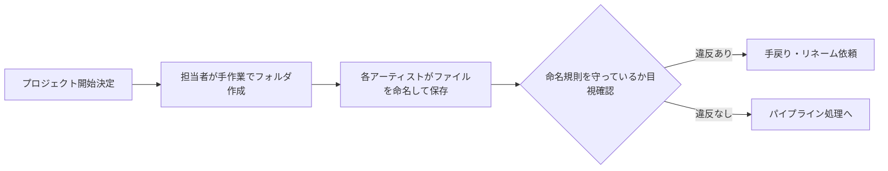
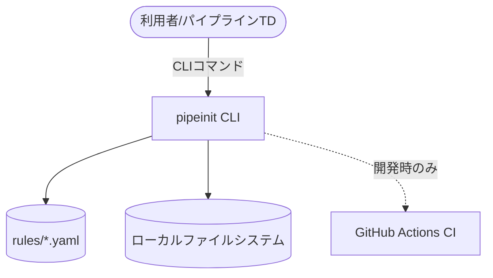
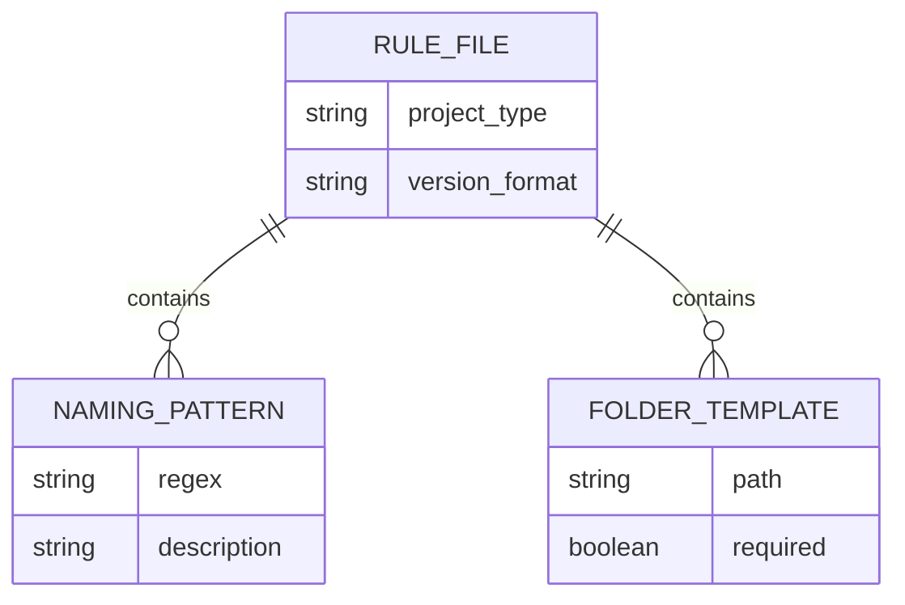
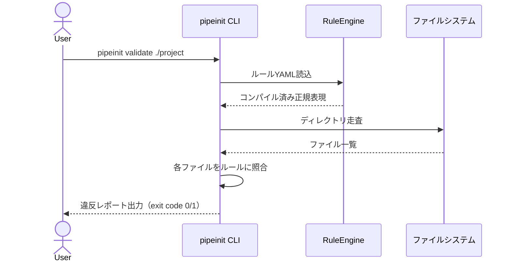

# 開発時要件定義: PipeInit

| 項目 | 値 |
|------|---|
| 版 | 0.1 |
| 作成日 | 2026-09-07 |
| 最終更新 | 2026-09-07 |
| ステータス | ドラフト |
| 著者 | 金子直樹 |
| 承認者 | 金子直樹（個人開発のためセルフ承認） |
| 関連 | [仕様書](./仕様書.md) |
| プロジェクトタイプ | MVP / 個人開発ポートフォリオ（`skills/requirements-pro` 重点度マトリクス: MVP/PoC 列を適用） |

> 本書は CGパイプラインエンジニア転職ポートフォリオ「PipeInit」の要件定義書。全16章を保持しつつ、決済・SaaS・マルチテナント等の該当しない章は「該当なし（理由）」として簡潔に処理している（`requirements-pro` スキルの MVP/PoC 重点度: ★☆☆ に準拠）。

---

## 1. 文書管理・メタ情報

### 1.1 改訂履歴

| 版 | 日付 | 変更概要 | 承認者 |
|---|---|---|---|
| 0.1 | 2026-09-07 | 初版作成 | 金子直樹 |

### 1.2 文書の位置づけ・想定読者

- **想定読者**: 自分自身（実装時のリファレンス）／ポートフォリオ審査者・面接官（設計思想の証明資料）
- **参照頻度**: 実装中は毎日参照、応募時は面接前に読み返し

### 1.3 ステータスダッシュボード

| 項目 | 状態 |
|---|---|
| 要件定義 | ✅ On target |
| 実装 | 未着手（[パイプライン転職ロードマップ](../../../パイプライン転職ロードマップ.md) Week1着手予定） |
| リリース（GitHub公開） | 未着手 |

### 1.4 関連ドキュメント

- `README.md`（実装後に作成）
- `docs/仕様書.md`（本書とペア）
- `.github/workflows/ci.yml`
- パイプライン転職ロードマップ（本プロジェクトの上位計画書）

### 1.5 用語集・略語集

| 用語 | 説明 |
|---|---|
| ショット（Shot） | VFX/アニメーション制作における最小管理単位の映像カット |
| HIP | Houdiniのシーンファイル拡張子 |
| 冪等性（Idempotency） | 同じ操作を複数回行っても結果が変わらない性質 |
| MoSCoW | Must/Should/Could/Won't による優先度分類法 |

### 1.6 参照標準・法令一覧

個人開発のCLIツールであり、決済・個人情報・医療等の規制対象領域を扱わないため、適用標準は開発品質・セキュリティ領域に限定する。

| 標準 | 版 | 適用範囲 |
|---|---|---|
| ISO/IEC/IEEE 29148:2018 | - | 本要件定義書の構成方針 |
| ISO/IEC 25010 (JIS X 25010) | - | 非機能要件（§6）の品質特性分類 |
| OWASP Top 10:2021 | - | §12 セキュリティ要件（該当するインジェクション対策のみ） |
| SPDX 3.0.1 | - | §15 ライセンス表記（任意・簡易） |

> <!-- 要レビュー --> PCI DSS / GDPR / NIST SP 800-63B-4 等は決済・個人情報を扱わないため対象外。将来ネットワーク機能（ShotGrid連携等）を追加する場合は再評価する。

### 1.7 トレーサビリティID体系

標準の `BR- / STK- / FR- / NFR- / SEC- / IF- / LEG- / TC-` を採用（LEGは本プロジェクトでは不使用）。

---

## 2. ビジネス要件

### 2.1 エレベーターピッチ

CG/ゲームスタジオのパイプライン担当者・アーティストが、プロジェクト立ち上げ時に手作業でフォルダを作り、命名規則をチェックリストで目視確認している非効率を、YAML駆動のCLIツールで自動化・標準化する。

### 2.2 解くべき課題の定量化

- 中〜大規模プロジェクトでは月あたり数十〜数百のショット/アセットフォルダが作成され、手作業では命名ミス・フォルダ構成のブレが恒常的に発生する（[パイプライン転職ロードマップ](../../../パイプライン転職ロードマップ.md) PROJECT 01 記載の現場課題）。
- 本ツールでは「フォルダ作成〜命名チェック」にかかる手作業時間を実質ゼロにすることを効果指標とする（定量計測は個人開発のため簡易ベンチマークで代替、§6.2参照）。

### 2.3 ビジネスゴール（BR）と Non-Goals

| ID | ゴール |
|---|---|
| BR-001 | プロジェクト種別に応じたフォルダツリーを1コマンドで生成できる |
| BR-002 | 命名規則違反をコマンド一発で検出できる |
| BR-003 | バージョン番号の採番ミスを自動化で防止する |
| BR-004 | スタジオごとに異なる命名規則をコード変更なしで切り替えられる |
| BR-005 | CGパイプラインエンジニア職の書類選考通過率向上に資する、品質基準（README/テスト/CI）を満たすOSSとして公開する |

**Non-Goals（やらないこと）**
- ShotGrid / Perforce 等の外部システム連携（v1では対象外）
- GUI（Webダッシュボード等）の提供（③PipeBoard miniで別途カバー）
- マルチユーザー・権限管理（個人利用CLIのため不要）
- クラウド同期・SaaS化

### 2.4 KGI / KPI

```
KGI: 2026-11-01までにCGパイプラインエンジニア職の書類選考通過率20%以上に資するポートフォリオ1本を完成させる
KPI:
  - 機能: 必須要件6項目（§5）を全て実装完了
  - 品質: pytestカバレッジ 80%以上
  - 期日: 2026-09-20までにREADME・デモGIF付きでGitHub公開
  - 証明力: 面接想定問答（§16.6）に対する回答を用意できる状態
```

### 2.5 ROI / 収益モデル

該当なし（収益を目的としない個人開発ポートフォリオ。投資対象は自分の学習時間と転職成功確率）。

### 2.6 主要機能サマリ（トップ5）

1. `pipeinit init` — プロジェクト種別を選んでフォルダツリーを自動生成
2. `pipeinit validate` — 既存プロジェクトの命名規則違反を検出・レポート
3. `pipeinit bump` — ファイル名のバージョン番号を安全にインクリメント
4. YAMLルールファイルによるスタジオ別ルール切り替え
5. GitHub Actionsによるルールのユニットテスト自動実行（CI）

### 2.7 システム化の範囲と Out of Scope

**範囲内**: ローカルファイルシステム上でのフォルダ生成・命名検証・バージョン管理支援
**Out of Scope**: ネットワーク通信、外部API連携、GUI、マルチユーザー同時実行、Windows以外のパス区切り文字の完全互換保証（v1はPOSIX優先、Windowsは簡易対応）

### 2.8 前提条件・制約事項

| 種別 | 内容 |
|---|---|
| 技術 | Python 3.11 固定・ローカル実行のみ |
| 予算 | ¥0（OSSライブラリのみ使用） |
| 期間 | 2026-09-07〜2026-09-20（1.5〜2週間） |
| リソース | 開発者1名（本人、現職と並行での学習時間内） |

### 2.9 ステークホルダー（STK）

| ID | 役割 |
|---|---|
| STK-001 | 開発者本人（金子直樹）— 実装・意思決定者 |
| STK-002 | ポートフォリオ審査者・面接官 — 利用者兼評価者 |
| STK-003 | 将来的な実務ユーザー（CGスタジオのパイプラインチーム）— 想定利用者、v1では仮想ペルソナ |

### 2.10 予算計画

該当なし（個人開発・無償OSSライブラリのみで構成、金銭的コストなし）。

### 2.11 体制

1人開発。設計・実装・テスト・ドキュメント作成・レビューを全て本人が担当。AIエージェント（Claude Code）をペアプログラミング的に活用。

### 2.12 マスタースケジュール

| マイルストーン | 日付 |
|---|---|
| 要件定義・仕様確定 | 2026-09-07 |
| 実装開始 | 2026-09-07 |
| コア機能完成（CLI 3コマンド + テスト） | 2026-09-13 |
| README・CI・デモGIF完成 | 2026-09-17 |
| GitHub公開（α相当） | 2026-09-20 |

---

## 3. 業務要件

### 3.1 As-Is業務フロー



### 3.2 To-Be業務フロー


自動化される範囲：フォルダ生成・命名規則チェック・バージョン採番。手作業として残る範囲：ファイルの実際の作成・編集そのもの（DCCツール上の作業）。

### 3.3 業務ルール・例外パターン

- ルールファイル（YAML）に定義されていない拡張子・パターンは「警告」として扱い、エラーで停止しない（現場ルールの過渡期対応を考慮）。
- 既存プロジェクトへの `init` 実行時、既存フォルダとの衝突は上書きせずスキップしてレポートする（冪等性、BR-003関連）。

### 3.4 ペルソナ

```
名前: 佐藤（仮）
役職: 中規模VFXスタジオのパイプラインTD見習い
ITリテラシー: Python基礎あり、CLI操作に抵抗なし
利用デバイス: 業務用Linux/macOSワークステーション
利用コンテキスト: 新規ショット追加のたびに実行、週次で命名チェックを流す
ジョブ（JTBD）: 「新人アーティストの命名ミスを、レビュー前に自動で拾いたい」
ペイン: 目視チェックの見落とし、スタジオごとに規則が違い覚えられない
ゲイン: `validate` 一発でCI相当のチェックができる安心感
```

### 3.5 カスタマージャーニー

個人利用のCLIツールのためマーケティング的ジャーニー（獲得〜収益化）は該当なし。利用ジャーニーとしては「導入（pipx install）→ 初回実行（init）→ 定常利用（validate/bump）」の3段階のみ。

### 3.6 オンボーディング要件

`pipeinit --help` と README のクイックスタートのみで初回成功体験（フォルダ生成）に到達できることを目標とする（Aha Moment = 初回 `init` 実行成功）。

### 3.7 業務トランザクション一覧

決済・会員登録等は存在しない。重要トランザクションは「フォルダ生成」「命名検証」「バージョン採番」の3つ（§5参照）。

### 3.8 業務頻度

想定利用頻度：プロジェクト開始時（`init`）は低頻度、`validate`/`bump` は日次〜週次を想定。

---

## 4. システム要件・アーキテクチャ

### 4.1 動作環境

| 項目 | 内容 |
|---|---|
| OS | macOS / Linux（Windowsは簡易対応、パス区切り文字のみ配慮） |
| Python | 3.11 固定 |
| インストール方法 | `pipx install .` または `pip install -e .` |

### 4.2 アーキテクチャ方式

単一プロセスのモノリスCLI（マイクロサービス等は不要な規模のため検討自体を省略）。

### 4.3 C4 Model（Context / Container）



Component分解は §5〜§8（ディレクトリ構成）に集約するため、本章ではContext/Containerレベルに留める。

### 4.4 技術スタック

| カテゴリ | 採用 | バージョン | 選定理由 | 代替案 | 却下理由 |
|---|---|---|---|---|---|
| 言語 | Python | 3.11固定 | Houdini/DCC連携との親和性、既存スキルの延長 | Go | CG業界標準はPython優位 |
| CLIフレームワーク | Click | 8.x | サブコマンド設計・testing.CliRunnerによるテスト容易性 | argparse | UX・テスト機構が弱い |
| 設定ファイル | PyYAML | 6.x | 人間が読み書きしやすい・スタジオごとのルール外部化に最適 | TOML | 業界慣習としてYAMLが主流 |
| テスト | pytest | 8.x | パラメータ化テストが容易 | unittest | 記述量が多い |
| Lint/Format | black, flake8, isort | 最新安定版 | 標準的な組み合わせ、CI導入が容易 | ruff一本化 | v1はシンプルさ優先、将来的にruff移行検討 |
| CI | GitHub Actions | - | 追加コストなし、GitHub公開との親和性 | - | - |

### 4.5 環境構成

開発環境（ローカル.venv）のみ。ステージング・本番環境という概念は存在しない（配布形態がPyPI/GitHub Releaseの静的パッケージのため）。

### 4.6 12-Factor 準拠チェック（該当項目のみ）

| Factor | 対応 |
|---|---|
| Codebase | 単一Gitリポジトリ |
| Dependencies | `pyproject.toml` で明示的に宣言 |
| Config | YAMLルールファイルで外部化（BR-004） |
| Build, release, run | GitHub Actions でテスト→タグ付けリリース |

その他（Backing services / Port binding 等）はネットワークサービスではないため該当なし。

### 4.7 データモデル



正本はYAMLファイル自体（DBは使用しない）。

### 4.8 データボリューム見積

数KB〜数十KBのYAMLルールファイル数個、生成対象フォルダ数百〜数千件規模を想定（スケール時の考察は §5 面接想定問答参照）。

### 4.9 シーケンス図（validate コマンド）



### 4.10 ADR運用方針

`docs/adr/NNNN-decision-title.md` にMichael Nygard形式で記録する。v1で起票予定のADR：
- ADR-0001: 正規表現+YAML方式を採用（パーサー/DSL自作を却下）
- ADR-0002: SQLite等のDBを使わずYAMLを正本とする

### 4.11 クラウドポータビリティ

該当なし（ローカル実行のCLIであり、クラウド依存なし）。

---

## 5. 機能要件

### 5.1 機能一覧（FR）

| ID | 機能 | 優先度 |
|---|---|---|
| FR-001 | プロジェクト種別選択によるフォルダツリー自動生成 | Must |
| FR-002 | 命名規則の正規表現バリデーション | Must |
| FR-003 | バージョン番号自動インクリメント | Must |
| FR-004 | YAML設定によるスタジオ別ルール切り替え | Must |
| FR-005 | 冪等性のある再実行（二重実行防止） | Must |
| FR-006 | GitHub ActionsによるCI自動テスト | Should |
| FR-007 | リネーム候補の提示（validate結果から） | Could |

### 5.2 アカウント・権限機能

該当なし（ローカルCLI・単一ユーザー実行のため、認証・アカウント機能は存在しない）。

### 5.3 権限マトリクス

該当なし（同上）。

### 5.4 機能詳細（FR-001〜FR-003）

```markdown
### FR-001 プロジェクト種別選択によるフォルダツリー自動生成

- **優先度**: Must
- **関連BR**: BR-001
- **Description**: `pipeinit init --type <game|film|generic>` でスタジオ標準のディレクトリ階層を生成する
- **Inputs**: プロジェクト種別（必須）、出力先パス（既定: カレントディレクトリ）
- **Processing**:
  1. `rules/<type>.yaml` を読込
  2. フォルダテンプレート定義を解決
  3. 既存フォルダとの衝突チェック（FR-005冪等性）
  4. フォルダツリーを生成
- **Outputs**: 成功時は生成フォルダ一覧を標準出力、失敗時はエラーコードと理由
- **UseCase**: 新規ショット/プロジェクトの立ち上げ
- **受入条件（AC）**:
  - 同一コマンドを2回実行しても既存フォルダは変更されない（冪等性）
  - 未知の `--type` 指定時は既知の選択肢一覧をエラーメッセージに含める

### FR-002 命名規則の正規表現バリデーション

- **優先度**: Must
- **関連BR**: BR-002
- **Description**: `pipeinit validate <path>` で指定ディレクトリ配下のファイル名を規則と照合する
- **Inputs**: 検証対象パス、（任意）ルールファイル指定
- **Processing**:
  1. ルールYAMLから正規表現パターンをコンパイル
  2. 対象ディレクトリを再帰的に走査
  3. 各ファイル名をパターンに照合
  4. 違反ファイルをリスト化
- **Outputs**: 違反一覧（ファイルパス・違反理由）、exit code（0=違反なし／1=違反あり）
- **UseCase**: CI組み込み、または定常的な品質チェック
- **受入条件（AC）**:
  - 違反0件の場合 exit code 0 で終了（CIゲートとして利用可能）
  - 大量ファイル（1000件規模）でも数秒以内に完了

### FR-003 バージョン番号自動インクリメント

- **優先度**: Must
- **関連BR**: BR-003
- **Description**: `pipeinit bump <filename>` でファイル名末尾のバージョン番号を1つ繰り上げる
- **Inputs**: 対象ファイル名（例: `SHOT010_lighting_v003.hip`）
- **Processing**:
  1. ファイル名からバージョン部分を正規表現抽出
  2. 数値をインクリメント（v999→v1000の桁上げ対応）
  3. 新ファイル名を生成（実ファイルのリネームは `--apply` フラグ時のみ）
- **Outputs**: 新ファイル名の提示、`--apply` 時は実際にリネーム実行
- **UseCase**: 新バージョン保存前の採番
- **受入条件（AC）**:
  - v999→v1000のように桁数が増えるケースを正しく処理する
  - `--apply` なしの場合はファイルシステムに一切変更を加えない（ドライラン既定）
```

### 5.5 業務ロジック・計算式

バージョン番号インクリメントのみ：`v{N:03d}` 形式を基本とし、N+1が4桁になる場合は `v{N+1}` をゼロ埋めせず桁数拡張する（例: v999 → v1000）。

### 5.6 検索機能要件

該当なし（v1では検索機能を持たない。`validate` の出力フィルタで代替）。

### 5.7 ファイルアップロード・ダウンロード

該当なし（ローカルファイルシステム操作のみ、ネットワーク経由のアップロード/ダウンロードは扱わない）。

### 5.8 通知要件

該当なし（CLIの標準出力・exit codeのみ。将来的にSlack Webhook通知を拡張案として検討、v1スコープ外）。

### 5.9 帳票・出力要件

`validate` コマンドは人間可読なテキスト出力に加え、`--format json` オプションでJSON出力にも対応する（CI連携・他ツールとの組み合わせを想定）。

### 5.10 サポート・FAQ機能

該当なし（README内のトラブルシューティングセクションで代替）。

### 5.11 管理画面要件

該当なし（GUIなしのCLIツール）。

### 5.12 エラー・例外処理方針

| エラーコード | 意味 |
|---|---|
| E001 | ルールYAMLの構文エラー |
| E002 | 未知のプロジェクト種別指定 |
| E003 | 検証対象パスが存在しない |
| E004 | バージョン番号のパターンにファイル名が一致しない |

すべてのエラーはユーザー向けメッセージ（何が起きたか・どう直すか）と、`--verbose` 時のみ表示する開発者向けスタックトレースを分離する（`coding-style.md` のエラー処理原則に準拠）。

---

## 6. 非機能要件（IPA + ISO 25010）

> IPA非機能要求グレード選定：**グレード1（基本）** — 個人開発・無料公開のCLIツールであり、社会的影響度は「限定」に該当するため。

### 6.1 可用性

該当なし（常時稼働するサービスではなく、実行時のみ動作するCLI）。

### 6.2 性能・拡張性

| NFR-ID | 内容 |
|---|---|
| NFR-001 | `validate` はファイル数1,000件規模で3秒以内に完了する |
| NFR-002 | `init` はフォルダ生成を1秒以内に完了する（標準的なテンプレート規模） |

### 6.3 ユーザビリティ

`pipeinit --help` および各サブコマンドの `--help` で、追加ドキュメントなしに主要操作を理解できることを目標とする（詳細はREADME参照）。

### 6.4 保守運用性

- コーディング規約：`coding-style.md`（1ファイル1責務、早期リターン、命名規則）に準拠
- MTTR目標：該当なし（個人開発・常時サポート体制なし）

### 6.5 移行性

該当なし（外部システムからの移行対象データが存在しない新規ツール）。

### 6.6 信頼性

`validate` の判定結果は同一入力に対して常に同一出力を返す（決定性）。ネットワークやDBに依存しないため、トランザクション保証の概念自体が不要。

### 6.7 互換性

Python 3.11 以降で動作すること。将来のPythonバージョンとの互換性は都度CIで確認する。

### 6.8 エコロジー

該当なし（ローカル実行の軽量CLIであり、消費電力・CO2排出の計測対象外）。

---

## 7. デザイン・UI/UX要件（CLI UX）

GUIを持たないため、Web向けのデザイントークン・WCAG準拠は該当なし。CLIとしてのユーザビリティ原則のみ適用する。

### 7.1 CLI UX原則

- `--help` は全サブコマンドに用意し、使用例を含める
- 色付き出力は `NO_COLOR` 環境変数尊重、ターミナル非対応時はプレーンテキストにフォールバック（アクセシビリティ相当の配慮）
- エラーメッセージは「何が起きたか」「どう直すか」の2点を必ず含める

### 7.2 国際化

該当なし（v1は日本語READMEのみ、CLIメッセージは英語で統一しグローバルなOSS慣習に合わせる）。

---

## 8. マーケティング・SEO・グロース要件

該当なし（個人開発ポートフォリオであり、マーケティング・SEO・広告計測・A/Bテストの対象ではない。GitHubリポジトリとしての見せ方は[パイプライン転職ロードマップ](../../../パイプライン転職ロードマップ.md) §8で別途扱う）。

---

## 9. 課金・決済要件

該当なし（無償OSSであり決済機能を持たない）。

---

## 10. API・外部連携要件

該当なし（v1はローカルCLIのみで、外部API・Webhook等のネットワーク通信を行わない）。将来ShotGrid連携を追加する場合は本章を再作成する。

---

## 11. バッチ・非同期処理要件

該当なし（同期的なCLIコマンド実行のみで、バッチジョブやキューイングの概念を持たない）。

---

## 12. セキュリティ要件

決済・個人情報・認証を扱わないため、OWASP ASVS等のフル適用は不要。ただし「ローカルファイルシステムを操作するCLI」特有のリスクには対応する。

| SEC-ID | 内容 |
|---|---|
| SEC-001 | YAML読込は `yaml.safe_load` のみを使用し、任意コード実行（`yaml.load` の危険性）を防止する |
| SEC-002 | ユーザー指定パスに対してパストラバーサル（`../` 等での意図しないディレクトリへの書き込み）を検証する |
| SEC-003 | `--apply` フラグなしでは実ファイルへの変更を一切行わない（誤操作によるデータ破壊防止） |
| SEC-004 | 依存ライブラリの脆弱性をDependabot/`pip-audit`でCI上チェックする |

---

## 13. テスト・品質保証要件

### 13.1 テスト戦略

```
Unit（ルール解析・正規表現・バージョン計算）: 70%
CLI統合テスト（click.testing.CliRunner）: 25%
手動確認（実ファイルシステムでのE2E的確認）: 5%
```

### 13.2 テストツール

pytest / pytest-cov / click.testing.CliRunner

### 13.3 受入・検収基準（Definition of Done）

- [ ] §5 の全FRに対応するテストが存在する
- [ ] pytestカバレッジ80%以上
- [ ] `pipeinit init` → `validate` → `bump` の一連の操作が実際のターミナルで確認済み

### 13.4 トレーサビリティマトリクス

| BR-ID | STK-ID | FR-ID | NFR/SEC-ID | TC-ID |
|---|---|---|---|---|
| BR-001 | STK-001 | FR-001 | NFR-002, SEC-002, SEC-003 | TC-001〜TC-003 |
| BR-002 | STK-002 | FR-002 | NFR-001 | TC-004〜TC-007 |
| BR-003 | STK-001 | FR-003 | - | TC-008〜TC-010 |
| BR-004 | STK-003 | FR-004 | SEC-001 | TC-011〜TC-012 |
| BR-003 | STK-001 | FR-005 | - | TC-013 |
| BR-005 | STK-002 | FR-006 | - | TC-014（CI自体の動作確認） |

### 13.5 CI/CD品質ゲート

lint（flake8）→ format確認（black --check）→ import順序（isort --check）→ pytest（カバレッジ計測）の順でGitHub Actions上で実行し、いずれか失敗でマージ不可とする。

---

## 14. インフラ・DevOps・SRE要件

該当なし（常時稼働するサービスを持たないローカルCLIのため、SLO/Error Budget/Runbook/DR等のSRE概念は適用対象外）。CI/CDのみ §13.5 で扱う。

---

## 15. 開発プロセス・規約

### 15.1 Git戦略

GitHub Flow（`main` 直push禁止、機能ブランチ + PR）。個人開発のためセルフレビューだが、PRを作成しCIを通してからマージする運用とする。

### 15.2 コミット規約

Conventional Commits（`feat:` / `fix:` / `test:` / `docs:` / `chore:`）、`git-workflow.md` に準拠。

### 15.3 コーディング規約

black・flake8・isort。`coding-style.md`（1ファイル1責務・イミュータビリティ優先・早期リターン）を適用。

### 15.4 ドキュメント運用

README.md（必須）、CHANGELOG.md（任意）、docs/adr/（設計判断の記録）。

### 15.5 ライセンス

MITライセンスを付与し、OSSとして公開する（ポートフォリオとしての閲覧性を最大化するため）。

---

## 16. リリース・移行計画

### 16.1 マスタースケジュール

§2.12 と同一（2026-09-20 GitHub公開）。

### 16.2 開発フェーズ

```
α（内部）
- 入場条件: FR-001〜005実装完了
- 退場条件: pytest全通過・カバレッジ80%以上

GA相当（GitHub一般公開）
- 入場条件: README・デモGIF・CI green・ライセンス表記完備
- 退場条件: なし（ポートフォリオとして継続公開）
```

β（招待制）は該当なし（個人開発ツールのため招待制フェーズを設けない）。

### 16.3 段階リリース

該当なし（フィーチャーフラグ等は不要な規模）。

### 16.4 データ移行計画

該当なし（新規ツールであり移行対象データが存在しない）。

### 16.5 ロールバック手順

Gitタグベースでの前バージョンへの復帰のみ（`git checkout v0.1`）。サーバー側の切り戻しは存在しない。

### 16.6 面接想定問答（ポートフォリオ特有の付記）

> 一般的な要件定義書には含まれないが、本書はポートフォリオ資料を兼ねるため、面接で問われうる設計判断への回答を付記する。

**Q. なぜ正規表現ベースで、パーサーやスキーマ言語を使わなかったのか？**
A. 命名規則は現場ごとに変わる「文字列パターン」の集合であり、構文木を持つ言語ではないため、学習コストが低い正規表現+YAMLの組み合わせが保守性で優れると判断した（ADR-0001参照）。

**Q. アセット数が10倍になったら何が壊れるか？**
A. フォルダツリー生成のI/O回数がボトルネックになりうる点、YAMLルールの正規表現バックトラッキングのコストが挙げられる。NFR-001の3秒/1,000件という目標値は、将来的な性能劣化を検知する回帰テストの基準にもなる。

---

<!-- 要レビュー: 実装後、実測値でNFR-001/NFR-002の数値目標を検証し、必要なら本書を更新すること -->
