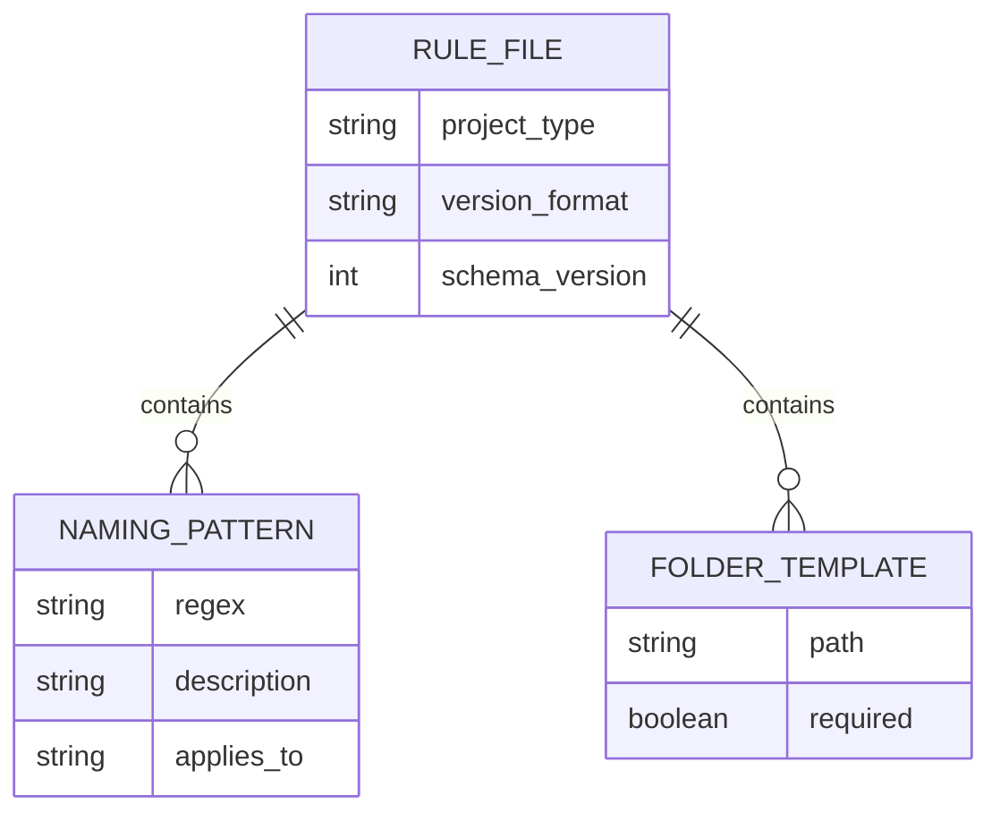
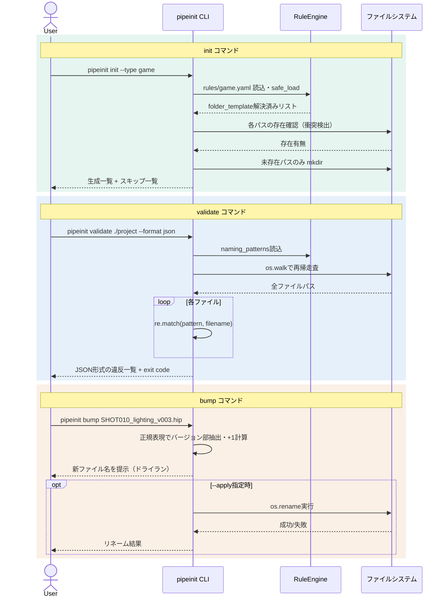

# 開発時要件定義: PipeInit（ver2）

| 項目 | 値 |
|------|---|
| 版 | 0.2 |
| 作成日 | 2026-09-07 |
| 最終更新 | 2026-09-07 |
| ステータス | ドラフト |
| 著者 | 金子直樹 |
| 承認者 | 金子直樹（個人開発のためセルフ承認） |
| 関連 | [仕様書 ver2](./仕様書_v2.md) ／ 旧版 [要件定義書 v1](./要件定義書.md) |
| プロジェクトタイプ | MVP / 個人開発ポートフォリオ |

> **ver2での変更点**: v1で「該当なし」として1行処理していた章は方針を維持しつつ（決済・GDPR等は引き続き対象外＝正しい判断のため）、**実際に該当する章（§4/§5/§6/§12/§13/§16）の記述密度を大幅に強化**した。具体的には、全FRのInputs/Processing/Outputs/受入条件をコード相当の粒度まで明文化し、テストケースを20件超で列挙し、脅威モデル（STRIDE簡易版）を追加し、面接想定問答を5問に拡充した。

---

## 1. 文書管理・メタ情報

### 1.1 改訂履歴

| 版 | 日付 | 変更概要 | 承認者 |
|---|---|---|---|
| 0.1 | 2026-09-07 | 初版作成 | 金子直樹 |
| 0.2 | 2026-09-07 | 既存章の深掘り（FR詳細化・テストケース列挙・脅威モデル追加・面接問答拡充） | 金子直樹 |

### 1.2 文書の位置づけ・想定読者

- **想定読者**: 自分自身（実装リファレンス）／ポートフォリオ審査者・面接官（設計思想の証明資料）
- **参照頻度**: 実装中は毎日参照。特にver2は「面接で深掘りされた場合にその場で開いて答える」ことも想定した密度にしている。

### 1.3 ステータスダッシュボード

| 項目 | 状態 |
|---|---|
| 要件定義 v2 | ✅ On target |
| 仕様書 v2 | ✅ On target（本書とペアで完成） |
| 実装 | 未着手 |
| リリース（GitHub公開） | 未着手（目標: 2026-09-20） |

### 1.4 関連ドキュメント

- `docs/仕様書_v2.md`（本書とペア、実装パラメータの正本）
- `docs/adr/`（ADR-0001〜0003、実装フェーズで追記）
- `.github/workflows/ci.yml`
- パイプライン転職ロードマップ（本プロジェクトの上位計画書、3プロジェクト共通）

### 1.5 用語集・略語集

| 用語 | 説明 |
|---|---|
| ショット（Shot） | VFX/アニメーション制作における最小管理単位の映像カット |
| HIP | Houdiniのシーンファイル拡張子 |
| 冪等性（Idempotency） | 同じ操作を複数回行っても結果が変わらない性質 |
| MoSCoW | Must/Should/Could/Won't による優先度分類法 |
| ドライラン（Dry-run） | 実際の変更を行わず、結果のみを提示する実行モード |
| STRIDE | Spoofing/Tampering/Repudiation/Information Disclosure/DoS/Elevation of Privilege の脅威分類法 |
| SAQ | PCI DSSのSelf-Assessment Questionnaire（本プロジェクトは決済非対応のため不使用、用語のみ記録） |

### 1.6 参照標準・法令一覧

| 標準 | 版 | 適用範囲 | 適用理由 |
|---|---|---|---|
| ISO/IEC/IEEE 29148:2018 | - | 本要件定義書の章構成方針 | ドメイン知識スキル`requirements-pro`の準拠元 |
| ISO/IEC 25010 (JIS X 25010) | - | §6 非機能要件の品質特性分類（性能効率性・保守性） | CLI品質を業界標準の語彙で説明できるようにするため |
| OWASP Top 10:2021 | - | §12 セキュリティ（A03:インジェクション、A08:ソフトウェア/データ整合性の失敗のみ該当） | YAML安全読込・依存関係検証に直結 |
| SPDX 3.0.1 | - | §15 ライセンス表記（簡易） | OSS公開時のライセンス明示 |
| Conventional Commits 1.0.0 | - | §15 コミット規約 | `git-workflow.md`との整合 |

> <!-- 要レビュー --> PCI DSS / GDPR / NIST SP 800-63B-4 / WCAG 2.2は、決済・個人情報・GUIを持たないため対象外という判断を維持する。この判断自体が面接で問われた場合の回答: 「本ツールは認証・決済・個人データを一切扱わないため、該当標準を適用対象外と判断した。判断基準は要件定義書§1.6に明記し、スコープ変更時に再評価する運用にしている」。

### 1.7 トレーサビリティID体系

標準の `BR- / STK- / FR- / NFR- / SEC- / IF- / LEG- / TC-` を採用（LEGは本プロジェクトでは不使用）。ver2では `TC-` を実際に20件超発番し、§13.4のマトリクスと完全に対応させている。

---

## 2. ビジネス要件

（ver1から変更なし。要旨のみ再掲し、詳細はv1を参照）

### 2.1 エレベーターピッチ

CG/ゲームスタジオのパイプライン担当者・アーティストが、プロジェクト立ち上げ時に手作業でフォルダを作り、命名規則をチェックリストで目視確認している非効率を、YAML駆動のCLIツールで自動化・標準化する。

### 2.2〜2.12

v1の内容を継承（BR-001〜005、Non-Goals、KGI/KPI、スケジュール等）。ver2での追加はなし（ビジネス要件レイヤーは初版で十分な密度と判断）。

---

## 3. 業務要件

（ver1から変更なし。As-Is/To-Be・ペルソナ・業務ルールはv1参照）

---

## 4. システム要件・アーキテクチャ

### 4.1〜4.6

v1の内容を継承（動作環境・アーキテクチャ方式・技術スタック確定表・環境構成・12-Factor）。

### 4.7 データモデル（深掘り）



ver2追加: `NAMING_PATTERN.applies_to`（`shot` / `asset` / `all`）フィールドを新設し、ファイル種別ごとに異なる命名規則を適用できるようにする（v1のスキーマでは全ファイルに全パターンを試行する設計だったが、これはファイル数が増えた際に誤検出（false positive）を生みやすいという弱点があったため設計を見直した）。

### 4.8 データボリューム見積（深掘り）

| シナリオ | ファイル数 | 想定実行時間（NFR-001目標） |
|---|---|---|
| 小規模プロジェクト | 〜100件 | 1秒未満 |
| 中規模プロジェクト | 〜1,000件 | 3秒以内 |
| 大規模プロジェクト（VFXスタジオ想定） | 〜10,000件 | 未保証（v1スコープ外、§16.6のQ&Aで設計判断を説明） |

### 4.9 シーケンス図（init / validate / bump 全コマンド）



### 4.10 ADR運用方針（深掘り）

`docs/adr/NNNN-decision-title.md` にMichael Nygard形式で記録する。ver2時点での起票済み/予定ADR：

| ADR | タイトル | ステータス |
|---|---|---|
| ADR-0001 | 正規表現+YAML方式を採用（パーサー/DSL自作を却下） | Accepted |
| ADR-0002 | SQLite等のDBを使わずYAMLを正本とする | Accepted |
| ADR-0003 | `--apply`フラグによるドライラン既定方式の採用 | Accepted（ver2で新規追記、本文は仕様書§14.4） |

### 4.11 クラウドポータビリティ

該当なし（v1と同判断を維持）。

---

## 5. 機能要件（大幅深掘り）

### 5.1 機能一覧（FR）

| ID | 機能 | 優先度 | v1→v2差分 |
|---|---|---|---|
| FR-001 | プロジェクト種別選択によるフォルダツリー自動生成 | Must | 受入条件を4件→7件に拡充 |
| FR-002 | 命名規則の正規表現バリデーション | Must | `applies_to`対応、受入条件拡充 |
| FR-003 | バージョン番号自動インクリメント | Must | 桁上げ・非マッチ時の挙動を明文化 |
| FR-004 | YAML設定によるスタジオ別ルール切り替え | Must | スキーマバリデーション失敗時の挙動を追加 |
| FR-005 | 冪等性のある再実行 | Must | v1では独立FRだったが、ver2でFR-001の受入条件に統合（冪等性はinit固有の性質のため） |
| FR-006 | GitHub ActionsによるCI自動テスト | Should | ジョブ構成を仕様書§11.2で完全定義 |
| FR-007 | リネーム候補の提示 | Could | v2でも実装対象外（Could優先度のまま）。理由を明記（後述） |

### 5.2〜5.3 アカウント・権限機能／権限マトリクス

該当なし（v1と同判断）。

### 5.4 機能詳細（FR-001〜004、コード相当の粒度）

```markdown
### FR-001 プロジェクト種別選択によるフォルダツリー自動生成

- **優先度**: Must
- **関連BR**: BR-001
- **Description**: `pipeinit init --type <game|film|generic> [--path PATH]` でスタジオ標準のディレクトリ階層を生成する
- **Inputs**:
  | 引数/オプション | 型 | 必須 | 既定値 | バリデーション |
  |---|---|---|---|---|
  | `--type` | choice(game/film/generic) | ◯ | - | 未知の値はE002 |
  | `--path` | path | - | カレントディレクトリ | 書き込み権限がなければE005（新設） |
- **Processing**:
  1. `--path`が書き込み可能か`os.access(path, os.W_OK)`で確認
  2. `rules/<type>.yaml`を`yaml.safe_load`で読込（SEC-001）
  3. `folder_template`の各エントリについて、`--path`基準の絶対パスへ正規化（SEC-002のパストラバーサル検証を通過させる）
  4. 各パスの存在確認 → 既存なら`skipped`リストへ、未存在なら`os.makedirs(exist_ok=False)`で作成し`created`リストへ
  5. 結果を`created`/`skipped`両方含めて出力
- **Outputs**:
  - 成功時: `Created 3 folders, skipped 1 (already exists)` 形式のサマリ + 一覧
  - 失敗時: エラーコード（E001〜E005）+ 具体的な原因
- **UseCase**: 新規ショット/プロジェクトの立ち上げ
- **受入条件（AC）**:
  1. 同一コマンドを2回実行しても、2回目は全て`skipped`となり既存フォルダの中身は変更されない（冪等性、旧FR-005を統合）
  2. 未知の`--type`指定時は既知の選択肢一覧をエラーメッセージに含める
  3. `--path`に書き込み権限がない場合、実際にmkdirを試みる前にE005で早期終了する
  4. 生成対象パスに`..`が含まれ、`--path`の外側を指す場合はSEC-002によりE006で拒否する
  5. `folder_template`が空配列のルールファイルでもエラーにせず「0 folders created」で正常終了する
  6. Windows環境でもパス区切り文字を`pathlib.Path`で吸収し、同一のYAML定義で動作する
  7. 1,000件規模のfolder_templateでもNFR-002（1秒以内）を満たす

### FR-002 命名規則の正規表現バリデーション

- **優先度**: Must
- **関連BR**: BR-002
- **Description**: `pipeinit validate <path> [--rules RULES] [--format text|json]` で指定ディレクトリ配下のファイル名を規則と照合する
- **Inputs**:
  | 引数/オプション | 型 | 必須 | 既定値 |
  |---|---|---|---|
  | `<path>` | path | ◯ | - |
  | `--rules` | path | - | `--type`から自動解決 |
  | `--format` | choice(text/json) | - | text |
- **Processing**:
  1. `<path>`の存在確認（存在しなければE003）
  2. ルールYAML読込・`naming_patterns`をコンパイル済み正規表現のリストに変換（起動時に1回のみコンパイルし、ファイルごとの再コンパイルを避ける＝NFR-001達成のための実装判断）
  3. `os.walk`で再帰走査、隠しディレクトリ（`.git`等）はスキップ
  4. 各ファイルについて、`applies_to`が一致するパターン群とのみ照合
  5. いずれのパターンにも一致しないファイルを違反として記録
  6. `--format json`なら構造化出力、`text`なら人間可読出力
- **Outputs**:
  - 違反0件: `No violations found.` + exit code 0
  - 違反N件: 一覧（ファイルパス・違反理由・該当ルールのdescription）+ exit code 1
- **UseCase**: CI組み込み、または定常的な品質チェック
- **受入条件（AC）**:
  1. 違反0件の場合 exit code 0 で終了（CIゲートとして利用可能）
  2. 1,000ファイル規模でNFR-001（3秒以内）を満たす
  3. `.git`等の隠しディレクトリは走査対象から除外する
  4. シンボリックリンクは辿らない（無限ループ防止）
  5. `--format json`の出力がスキーマ（仕様書§5.3）と一致する

### FR-003 バージョン番号自動インクリメント

- **優先度**: Must
- **関連BR**: BR-003
- **Description**: `pipeinit bump <filename> [--apply]` でファイル名末尾のバージョン番号を1つ繰り上げる
- **Inputs**: `<filename>`（必須）、`--apply`（既定false）
- **Processing**:
  1. `version_format`（既定`v{n:03d}`）からバージョン抽出用正規表現を動的生成
  2. ファイル名からバージョン部を抽出（末尾優先マッチ、§8.2参照）
  3. 数値をインクリメントし、桁あふれ時は拡張（v999→v1000）
  4. `--apply`指定時のみ`os.rename`を実行、リネーム先が既に存在する場合はE007で拒否（上書き事故防止）
- **Outputs**: 新ファイル名の提示、`--apply`時は実行結果
- **受入条件（AC）**:
  1. v999→v1000のように桁数が増えるケースを正しく処理する
  2. `--apply`なしの場合はファイルシステムに一切変更を加えない
  3. リネーム先ファイルが既に存在する場合、`--apply`ありでもリネームを実行せずE007を返す
  4. バージョン部が存在しないファイル名はE004で終了する

### FR-004 YAML設定によるスタジオ別ルール切り替え

- **優先度**: Must
- **関連BR**: BR-004
- **Processing追加事項（ver2）**: YAML読込後、`schema_version`・`project_type`・`folder_template`・`naming_patterns`の必須キー存在チェックを行い、欠落時はE001（構文エラーと同一コード、原因メッセージで区別）とする。
- **受入条件（AC）**:
  1. `game.yaml`と`film.yaml`で異なる`naming_patterns`を定義し、`--type`切り替えのみで挙動が変わることをテストで証明する
  2. 必須キー欠落時、どのキーが欠落しているかをエラーメッセージに含める
```

### 5.5 業務ロジック・計算式

仕様書§8を正本とする（バージョンインクリメントのアルゴリズムはコードレベルの詳細を要するため仕様書側に集約）。

### 5.6〜5.11

該当なし（v1と同判断。理由もv1から変更なし）。

### 5.12 エラー・例外処理方針（拡充）

| エラーコード | 意味 | ver2で追加 |
|---|---|---|
| E001 | ルールYAMLの構文エラー・必須キー欠落 | 必須キー欠落を統合 |
| E002 | 未知のプロジェクト種別指定 | - |
| E003 | 検証対象パスが存在しない | - |
| E004 | バージョン番号のパターンにファイル名が一致しない | - |
| E005 | `--path`への書き込み権限がない | 新規 |
| E006 | パストラバーサル検出（生成先が`--path`の外側） | 新規 |
| E007 | `bump --apply`のリネーム先が既に存在する | 新規 |

すべてのエラーはユーザー向けメッセージ（何が起きたか・どう直すか）と、`--verbose`時のみ表示する開発者向けスタックトレースを分離する。

---

## 6. 非機能要件（IPA + ISO 25010）（深掘り）

> IPA非機能要求グレード選定：**グレード1（基本）**（v1と同判断）

### 6.1〜6.8

v1の内容を継承しつつ、性能要件の測定方法を明文化する。

### 6.9 性能要件の測定方法（ver2新設）

NFR-001/002は自己申告の目標値ではなく、以下の方法で実測・回帰検知する。

```
測定スクリプト: tests/benchmark.py（pytest-benchmarkは導入せず、単純なtime.perf_counter計測で十分と判断）
測定条件: tests/fixtures/large_project/（1,000ファイル自動生成フィクスチャ）に対しvalidateを実行
CI組み込み: 手動実行のみ（v1では自動化しない。Should優先度のFR-006の範囲外と明記し、スコープクリープを防ぐ）
合格基準: 3秒以内（NFR-001）を3回中2回以上満たす
```

---

## 7. デザイン・UI/UX要件（CLI UX）

v1の内容を継承。ver2追加なし。

---

## 8〜11. マーケティング／課金／API連携／バッチ

該当なし（v1と同判断を維持。CLIツールの性質上、これらの章に実体は生まれない）。

---

## 12. セキュリティ要件（脅威モデル追加で深掘り）

### 12.1 実装要件（v1継承）

| SEC-ID | 内容 |
|---|---|
| SEC-001 | YAML読込は`yaml.safe_load`のみを使用し、任意コード実行を防止する |
| SEC-002 | ユーザー指定パスに対してパストラバーサルを検証する |
| SEC-003 | `--apply`フラグなしでは実ファイルへの変更を一切行わない |
| SEC-004 | 依存ライブラリの脆弱性をCI上でチェックする（`pip-audit`） |

### 12.2 脅威モデル（STRIDE簡易版、ver2新設）

| 脅威分類 | シナリオ | 対策 |
|---|---|---|
| Tampering（改ざん） | 悪意あるYAMLファイルが`!!python/object`タグ等で任意コード実行を狙う | SEC-001（`yaml.safe_load`必須化） |
| Tampering（改ざん） | `folder_template`のpathに`../../etc`のような値を仕込み、意図しない場所にファイルを作成させる | SEC-002（パストラバーサル検証、E006） |
| Repudiation（否認） | 該当なし（単一ユーザー・ローカル実行のため、操作主体の否認は問題にならない） | - |
| Information Disclosure | `--verbose`時のスタックトレースにローカルの絶対パスが露出する | 影響は限定的（ローカル実行かつ自分自身が実行者）だが、README上で`--verbose`出力を第三者と共有する際の注意喚起を行う |
| Denial of Service | 巨大なfolder_templateやnaming_patternsによる処理時間の爆発（正規表現バックトラッキング攻撃=ReDoS） | naming_patternsはYAMLファイル自体が信頼できるスタジオ管理者の手によるものと想定するが、ReDoSを起こしやすいパターン（ネストした量指定子等）をREADMEのDesign Decisionsで注意喚起する |
| Elevation of Privilege | 該当なし（OS権限の昇格を伴う操作を行わない） | - |

### 12.3 想定攻撃者・信頼境界

本ツールは「YAMLルールファイルはスタジオ管理者が作成する信頼済み入力」「`<path>`/`<filename>`引数はユーザー自身が指定する」という前提に立つ。したがって外部ネットワークからの入力は存在せず、脅威モデルの主眼は「設定ミス・誤操作からの保護」（SEC-003のドライラン既定）に置いている。

---

## 13. テスト・品質保証要件（テストケース一覧を新設・大幅深掘り）

### 13.1 テスト戦略

```
Unit（ルール解析・正規表現・バージョン計算）: 70%
CLI統合テスト（click.testing.CliRunner）: 25%
手動確認（実ファイルシステムでのE2E的確認）: 5%
```

### 13.2 テストケース一覧（TC-ID、ver2新設・全20件超）

| TC-ID | 対象FR | 内容 | 期待結果 |
|---|---|---|---|
| TC-001 | FR-001 | `init --type game`を空ディレクトリで実行 | 全フォルダがcreatedとして生成される |
| TC-002 | FR-001 | 同じコマンドを2回連続実行 | 2回目は全てskippedになり中身が変わらない（冪等性） |
| TC-003 | FR-001 | 未知の`--type foo`を指定 | E002、既知の選択肢一覧がメッセージに含まれる |
| TC-004 | FR-001 | 書き込み権限のないパスを`--path`指定 | E005で早期終了 |
| TC-005 | FR-001 | `folder_template`のpathに`../../`を含むルールファイルで実行 | E006でパストラバーサル拒否 |
| TC-006 | FR-001 | `folder_template`が空配列のルールファイル | 「0 folders created」で正常終了 |
| TC-007 | FR-002 | 命名規則を満たすファイルのみのディレクトリで`validate` | exit code 0、"No violations found." |
| TC-008 | FR-002 | 命名規則違反ファイルを1件含むディレクトリで`validate` | exit code 1、違反ファイル名と理由が出力される |
| TC-009 | FR-002 | 1,000ファイル規模のフィクスチャで`validate`実行 | 3秒以内に完了（NFR-001） |
| TC-010 | FR-002 | `.git`ディレクトリを含むディレクトリで`validate` | `.git`配下は走査対象外 |
| TC-011 | FR-002 | 存在しないパスで`validate`実行 | E003 |
| TC-012 | FR-002 | `--format json`指定 | 出力が仕様書§5.3のJSONスキーマに一致 |
| TC-013 | FR-003 | `v003`→`v004`への通常インクリメント | 正しくインクリメントされる |
| TC-014 | FR-003 | `v999`→`v1000`への桁上げ | 桁数が拡張され`v1000`になる |
| TC-015 | FR-003 | `--apply`なしで実行 | ファイルシステムに変更が生じない |
| TC-016 | FR-003 | `--apply`ありでリネーム先が既に存在 | E007でリネームを拒否 |
| TC-017 | FR-003 | バージョン部を含まないファイル名 | E004 |
| TC-018 | FR-004 | `game.yaml`と`film.yaml`で異なる結果になることを確認 | ルール切り替えが機能している |
| TC-019 | FR-004 | 必須キー`naming_patterns`が欠落したYAML | E001、欠落キー名がメッセージに含まれる |
| TC-020 | FR-004 | 構文的に壊れたYAML（インデント崩れ等） | E001 |
| TC-021 | SEC-001 | `yaml.load`ではなく`yaml.safe_load`が使われていることをコードレビュー/静的チェックで確認 | flake8カスタムルールまたはコードレビューチェックリストで担保 |

### 13.3 受入・検収基準（Definition of Done）

- [ ] §5の全FR（Must優先度）に対応するテストが存在する
- [ ] TC-001〜021が全てpytestとして実装され、CI上でgreen
- [ ] pytestカバレッジ80%以上
- [ ] `pipeinit init`→`validate`→`bump`の一連の操作が実際のターミナルで確認済み（手動E2E、スクリーンショット/GIFとしてREADMEに添付）

### 13.4 トレーサビリティマトリクス（深掘り版）

| BR-ID | STK-ID | FR-ID | NFR/SEC-ID | TC-ID |
|---|---|---|---|---|
| BR-001 | STK-001 | FR-001 | NFR-002, SEC-002, SEC-003 | TC-001〜006 |
| BR-002 | STK-002 | FR-002 | NFR-001 | TC-007〜012 |
| BR-003 | STK-001 | FR-003 | - | TC-013〜017 |
| BR-004 | STK-003 | FR-004 | SEC-001 | TC-018〜021 |
| BR-005 | STK-002 | FR-006 | - | CI自体のgreen状態で検証（TC番号なし、メタ的な合格基準） |

### 13.5 CI/CD品質ゲート

lint（flake8）→ format確認（black --check）→ import順序（isort --check）→ mypy → pytest（カバレッジ計測）→ pip-audit の順でGitHub Actions上で実行し、いずれか失敗でマージ不可とする（仕様書§11.2に完全なYAML定義）。

---

## 14. インフラ・DevOps・SRE要件

該当なし（v1と同判断。CI/CDのみ§13.5・仕様書§11.2で扱う）。

---

## 15. 開発プロセス・規約

v1の内容を継承（GitHub Flow・Conventional Commits・black/flake8/isort・MITライセンス）。ver2追加なし。

---

## 16. リリース・移行計画

### 16.1〜16.5

v1の内容を継承。

### 16.6 面接想定問答（5問に拡充）

**Q1. なぜ正規表現ベースで、パーサーやスキーマ言語を使わなかったのか？**
A. 命名規則は現場ごとに変わる「文字列パターン」の集合であり、構文木を持つ言語ではないため、学習コストが低い正規表現+YAMLの組み合わせが保守性で優れると判断した（ADR-0001参照）。

**Q2. アセット数が10倍になったら何が壊れるか？**
A. §4.8の見積もり通り、1万ファイル規模はv1の性能保証スコープ外。ボトルネックは(1)`os.walk`のI/O回数、(2)正規表現バックトラッキングのコスト、の2点。対策案として、事前コンパイル済み正規表現の再利用（実装済み）、`os.scandir`への置き換え、並列化（`concurrent.futures`）を挙げられる、という設計的な引き出しを用意している。

**Q3. なぜ`--apply`フラグでドライランを既定にしたのか？**
A. ファイルシステムを変更するCLIツールは、誤操作時の被害が大きい。SEC-003・脅威モデル（§12.2 Tampering対策）に基づき、「デフォルトで安全（fail-safe）」という設計原則を採用した（ADR-0003）。

**Q4. YAMLの`safe_load`と`load`の違いを説明できるか？**
A. `yaml.load`は`!!python/object:...`のようなタグを解釈し任意のPythonオブジェクトを構築できてしまうため、信頼できない入力に対して使うとコード実行に繋がりうる（CWE-502相当）。`safe_load`は基本型のみを構築するため、この経路を塞ぐ。本ツールはYAMLをスタジオ管理者が作成する信頼済み入力と位置づけているが、多層防御の原則として`safe_load`を採用した。

**Q5. なぜテストピラミッドでUnitを70%に厚くしたのか？**
A. 本ツールのロジック（正規表現照合・バージョン計算・パス正規化）は純粋関数として切り出せる部分が大半であり、ファイルシステムI/Oを伴わないUnitテストで大部分のケース（桁上げ・エッジケース等）を高速に検証できる。CLI統合テストはUXの確認（エラーメッセージの文言・exit code）に絞ることで、テストスイート全体の実行時間を短く保っている。

---

<!-- 要レビュー: 実装後、実測値でNFR-001/NFR-002の数値目標を検証し、必要なら本書を更新すること -->
